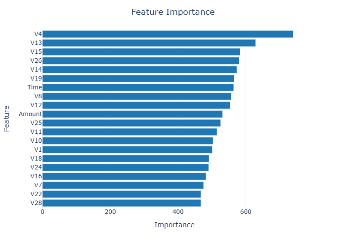
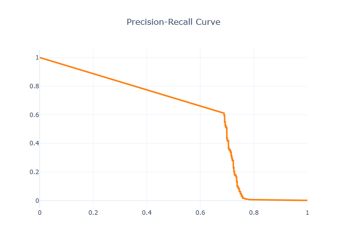
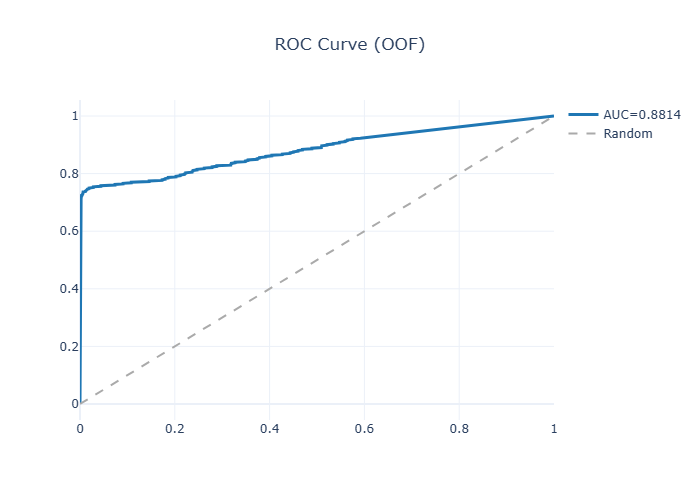

<h1 align="center">💳 Fraud Detection + AI Analyst (Streamlit App)</h1>
<p align="center">
An intelligent, AI-powered fraud detection and analysis system built using Streamlit, LightGBM, and LLMs
</p>

---

### 🧑‍🏫 Guided By  
<p align="center">
<b> Jeffrey Shaffer</b> — Director, Applied AI Lab & First Reader, University of Cincinnati  
<br>
<b> Lucas Timothy</b> — Assistant Professor of Business Analytics Dept. & Second Reader, University of Cincinnati  
</p>

---

## 🗂️ Access Project Files  

<p align="center">
  <a href="https://drive.google.com/drive/folders/1mXnE6D2vFTyS9GKsXLJ2-OXy61RP6mr3?usp=drive_link">
    
  </a>
</p>

All project-related files including the Streamlit source code, PDF report, datasets, and documentation are available in the shared Google Drive folder linked above.  


## 🚀 Project Overview

The **Fraud Detection + AI Analyst** app is an **interactive fraud risk analysis tool** that combines **machine learning**, **cost-sensitive optimization**, and **AI-based interpretation** to help financial analysts detect fraudulent transactions more effectively.

### 🎯 Core Objectives
- ⚡ **Predict fraudulent transactions** using LightGBM & Logistic Regression  
- 📉 **Optimize decision thresholds** via cost-based evaluation (False Positives vs False Negatives)  
- 🧩 **Interpret metrics automatically** through an integrated AI Analyst (LLM)  
- 📊 **Visualize performance** using ROC, Precision-Recall, Confusion Matrix, and Feature Importance plots  
- 📄 **Generate PDF summaries** of AI-driven recommendations  

Built for **financial institutions and risk teams**, the app transforms raw transaction data into actionable insights — combining automation, explainability, and visual storytelling.

---

## 🧰 Tech Stack

| Technology | Description |
|------------|-------------|
|  | Core scripting and ML pipeline |
|  | Interactive dashboard framework |
|  | Gradient boosting model for fraud prediction |
|  | Model training, cross-validation, metrics |
|  | Data cleaning and transformation |
|  | Numerical processing |
|  | Interactive data visualization |
|  | PDF report generation |
|  | LLM-powered AI Analyst module |

---

## 🔁 Workflow Overview

### 1️⃣ Upload Data
- Accepts either:
  - A merged CSV file with **`isFraud`** column, or  
  - Separate **Transaction.csv** and **Identity.csv** files  
- Automatically merges, validates, and prepares input

### 2️⃣ Preprocess Data
- Cleans column names and removes unnecessary fields  
- Encodes categorical variables using **OrdinalEncoder**  
- Standardizes binary target column (`isFraud`)

### 3️⃣ Train Model
- Trains using **LightGBM** or **Logistic Regression**  
- Supports **Time-Aware K-Fold** and **Stratified K-Fold** cross-validation  
- Generates **Out-of-Fold (OOF)** predictions for honest AUC evaluation

### 4️⃣ Evaluate Performance
- Visualizes:
  - 🧮 Confusion Matrix  
  - 📈 ROC Curve with AUC  
  - 📊 Precision-Recall Curve  
- Displays precision, recall, accuracy, FPR, and cost metrics

### 5️⃣ Threshold Optimization
- Lets users define **False Positive** and **False Negative** costs  
- Automatically identifies the **cost-optimal threshold**  
- Provides downloadable CSV of all threshold statistics

### 6️⃣ Feature Importance
- Displays **top predictive features** using interactive bar plots  
- Helps analysts understand which transaction attributes drive fraud risk

### 7️⃣ AI Analyst
- Integrates with **OpenAI / Groq LLM APIs**  
- Auto-interprets model metrics & recommends next actions  
- Users can ask natural-language questions like:  
  > “What threshold minimizes cost given our FP/FN ratio?”  
  > “Which features contribute most to false positives?”  
- Generates a **PDF report** summarizing key AI recommendations

---

## 📈 Key Outputs
| Output | Description |
|--------|--------------|
| 🧮 **Confusion Matrix** | Interactive heatmap with true vs predicted outcomes |
| 📊 **ROC Curve** | Model discrimination with AUC score |
| 📉 **Precision-Recall Curve** | Trade-off visualization between recall and precision |
| 🧱 **Feature Importance** | Ranked impact of key predictors |
| 🤖 **AI Analyst Report (PDF)** | Actionable AI summary and recommendations |

---

## 🖥️ How to Run

### 🔧 Install Dependencies

```bash

pip install streamlit scikit-learn lightgbm pandas numpy plotly requests pydantic reportlab
```
## ▶️ Launch the App

```bash

streamlit run "Fraud Detection + AI Analyst — Streamlit (Sujith-custom).py"
```

🔑 (Optional) Set API Credentials

```bash
export OPENAI_API_KEY="your_api_key"
export OPENAI_BASE_URL="https://api.groq.com/openai"
export OPENAI_MODEL="groq/compound"
```
## 🖼️ Application Screenshots  

<table>
  <tr>
    <td align="center">
      <a href="Images/Screenshot%202025-10-18%20172343.png">
        
      </a>
      <br><em>🏠 Home Interface — Fraud Detection + AI Analyst</em>
    </td>
    <td align="center">
      <a href="Images/Screenshot%202025-10-18%20182810.png">
        
      </a>
      <br><em>📊 Data Upload & Validation Module</em>
    </td>
  </tr>

  <tr>
    <td align="center">
      <a href="Images/Screenshot%202025-10-21%20171613.png">
        
      </a>
      <br><em>⚙️ Model Training and Evaluation Workflow</em>
    </td>
    <td align="center">
      <a href="Images/Screenshot%202025-10-21%20183756.png">
        
      </a>
      <br><em>📈 Threshold Metrics and Evaluation Table</em>
    </td>
  </tr>

  <tr>
    <td align="center">
      <a href="Images/Screenshot%202025-10-21%20183811.png">
        
      </a>
      <br><em>📉 Threshold Optimization and Cost Analysis</em>
    </td>
    <td align="center">
      <a href="Images/Screenshot%202025-10-21%20190203.png">
        
      </a>
      <br><em>🤖 AI Analyst — Summary and Recommendations</em>
    </td>
  </tr>

  <tr>
    <td align="center">
      <a href="Images/confusion_matrix.png">
        
      </a>
      <br><em>🧮 Confusion Matrix — True vs Predicted Fraud Cases</em>
    </td>
    <td align="center">
      <a href="Images/feature_importance.png">
        
      </a>
      <br><em>🧱 Feature Importance — Top Predictors of Fraud</em>
    </td>
  </tr>

  <tr>
    <td align="center">
      <a href="Images/precision_recall.png">
        
      </a>
      <br><em>📊 Precision-Recall Curve — Model Performance</em>
    </td>
    <td align="center">
      <a href="Images/roc_curve.png">
        
      </a>
      <br><em>🚀 ROC Curve (AUC = 0.8814) — Model Discrimination Strength</em>
    </td>
  </tr>
</table>

